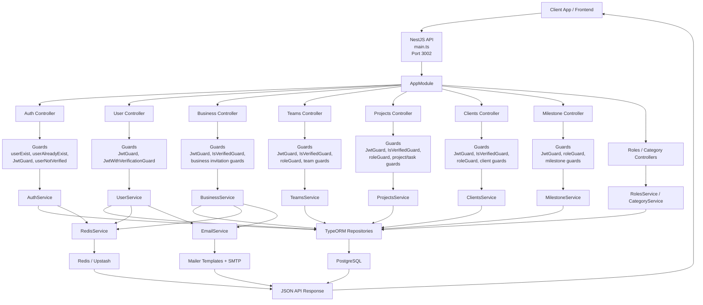
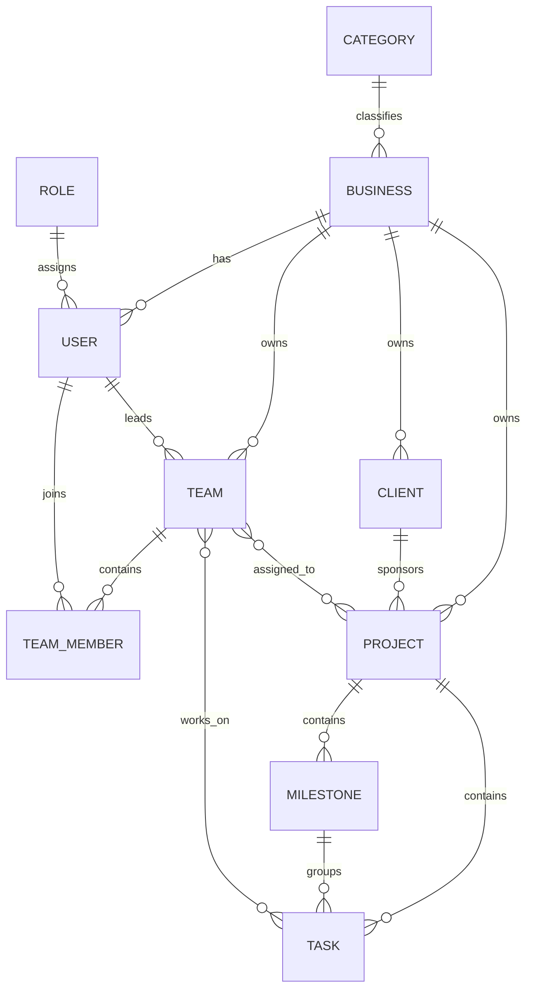

# Backend-SynergiSuite Flow Diagram

This diagram is derived from the current NestJS codebase under `src/`.

## Application Flow

## Core Business Journey

```mermaid
flowchart LR
    A["User Signup<br/>POST /auth/new"] --> B["AuthService.create"]
    B --> C["Hash password + create JWT"]
    C --> D["Save User"]

    D --> E["Request verification<br/>POST /user/request-verify-email"]
    E --> F["Generate OTP in Redis"]
    F --> G["Send verification email"]
    G --> H["Verify email<br/>PATCH /auth/verify-email"]

    H --> I["Login<br/>POST /auth/login"]
    I --> J["JWT issued"]

    J --> K["Register business<br/>POST /business/register"]
    K --> L["Create Business + assign owner role"]

    L --> M["Invite employee<br/>POST /business/invite"]
    M --> N["Store invitation token in Redis"]
    N --> O["Send invitation email"]
    O --> P["Employee joins business<br/>POST /business/join-business"]

    P --> Q["Create teams / clients"]
    Q --> R["Create project"]
    R --> S["Assign teams to project"]
    S --> T["Create milestones"]
    T --> U["Create tasks"]
    U --> V["Update task status / priority / due date"]
```

## Main Domain Relationships

## Notes

- Authentication is JWT-based through `JwtStrategy` and `JwtGuard`.
- Verification codes and invitation tokens are stored in Redis with expiry.
- Most business, team, project, client, and milestone routes are protected by layered guards before service execution.
- Persistent data is handled through TypeORM repositories backed by PostgreSQL.
